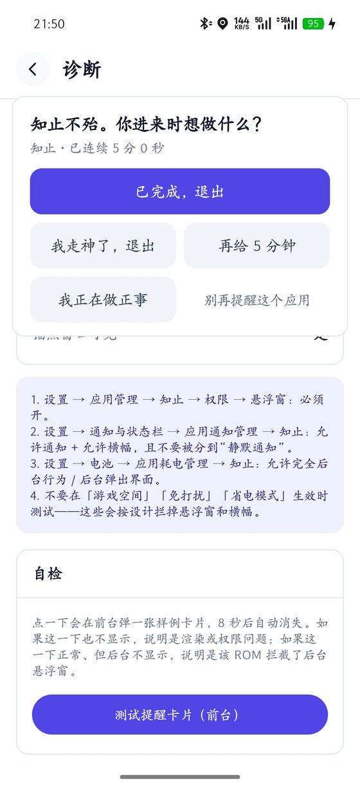
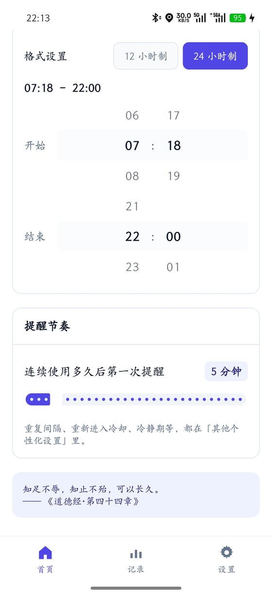
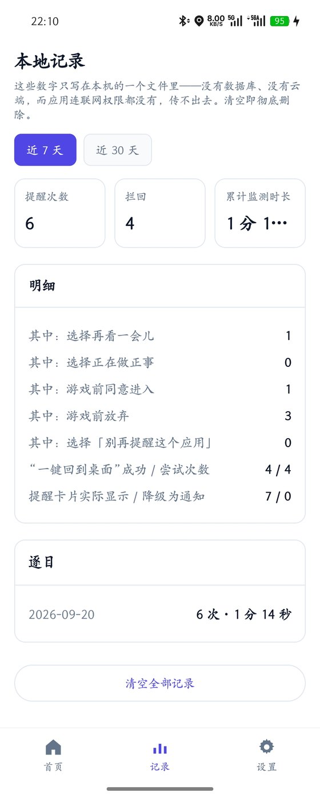
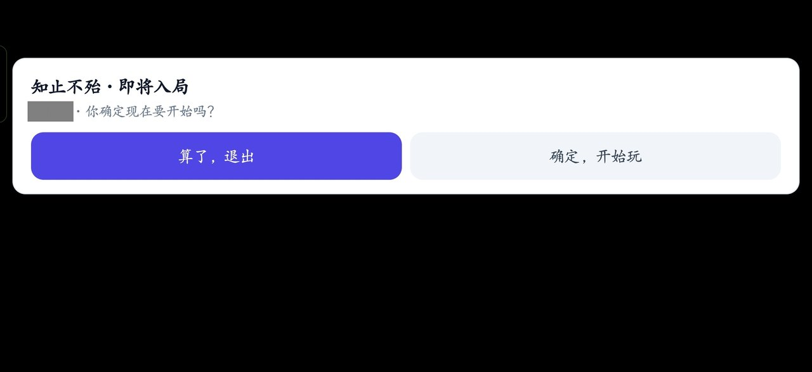

# 知止 ZhiZhi

一个不锁机、不弹常驻计时器的 Android 专注辅助工具。
在你可能走神的时候，它只问一句：**“你进来时想做什么？”**

`当前版本 1.0.8` · `Android 8.0+` · `约 1.8 MB` · `GPL-3.0` · `无联网权限 · 无广告 · 无内购`

<p align="center">
  
  
  
</p>

---

## 它做什么

| 场景 | 它的行为 |
| --- | --- |
| 打开小红书 / 抖音 / B站 | 屏幕上什么都不显示。后台安静计时，超过阈值后弹出一张卡片 |
| 打开王者荣耀 / 原神 | 游戏加载前问一次“你确定现在要开始吗”。回答之后**局内完全静默**，不会断触 |
| 学习途中想休息 | 首页或通知栏一键休息，期间完全不打扰；到点弹「知止不殆 · 休息有度」 |
| 不在设定时段内 | 服务照常在后台，但完全不监测、不提醒 |
| 某个应用不想管 | 卡片上点「别再提醒这个应用」，永久移出监控名单 |

提醒卡片上有四个答案，你选哪个都行：

* **已完成，退出** —— 记一次统计，回到桌面
* **再给 N 分钟** —— 推迟 N 分钟（默认 5）后再问一次
* **我走神了，退出** —— 记一次统计，回到桌面
* **我正在做正事** —— 进入冷静期（默认 15 分钟），期间不再打扰

它**不会**做的事：锁你的屏幕、阻止你打开任何应用、强制关闭你正在用的应用。
你随时可以忽略那张卡片继续玩——这是设计如此。

<p align="center">
  
</p>

> 游戏这一类是**启动前问一次、局内彻底静默**。局内弹窗会造成断触，
> 而这个工具最不该做的事，就是变成新的干扰。

---

## 下载与安装

前往 [**Releases**](https://github.com/Luo-chiyun/zhizhi-android/releases) 下载最新 APK。

> **认准正式签名的包**：文件名形如 `ZhiZhi-1.0.8-release.apk`。
> 不要安装调试包（`app-debug.apk`，包名带 `.debug`）——签名不同，
> 装了它之后无法用正式版覆盖升级，只能卸载重装、数据全丢。

首次启动会逐项引导授权，每一项都写明了用途。

| 权限 | 必要性 | 用途 |
| --- | --- | --- |
| 使用情况访问 | **必需** | 读取“当前前台是哪个应用”。这是唯一的数据来源 |
| 悬浮窗 | **必需** | 显示提醒卡片；同时是系统允许本应用在后台持续运行的前提 |
| 通知 | 可选 | 一条无声、不振动的前台服务通知；悬浮窗被系统拦掉时用作降级提醒 |
| 电池优化白名单 | 可选 | 避免系统在后台把监测服务杀掉 |

**国产 ROM 还多一步。** 只开上面这几项，提醒往往还是弹不出来：

* **小米 / 红米 / POCO**：除悬浮窗外还要单独允许「后台弹出界面」
* **OPPO / 一加 / realme**：要开「允许后台弹出界面」「允许自启动」「允许关联启动」
* **华为 / 荣耀**：把应用启动管理从「自动管理」改成「手动管理」，再打开三个子开关
* **vivo / iQOO**：要开「后台弹出界面」和「自启动」

应用内的权限检查页会**自动识别机型**，只显示你这台机器对应的步骤，并给出跳转按钮。

---

## 分类与预设名单

每个应用有三种状态：

| 状态 | 含义 |
| --- | --- |
| 不监控 | 明确不管它（套用预设不会覆盖这个决定） |
| 娱乐 / 社交 | 超时后温和提醒 |
| 游戏 | 启动前确认一次，局内静默 |

内置预设名单 **296 条**（不用监测 93 / 娱乐 103 / 游戏 100），覆盖国内主流应用。
套用时先与你机器上已安装的列表求交集，只对装了的应用生效；
偏门应用可以在「监控哪些应用」里手动勾选。

---

## 它是怎么知道我在用什么的

只用一个系统接口：**`UsageStatsManager`**。不申请无障碍权限
（`AccessibilityService`），所以也不会被判定为“滥用无障碍”。

代价是**有 0.5–2 秒延迟**——这个接口的事件是异步写入的。所以“游戏启动前确认”
用的是加载期那几秒的窗口，**不是 0 延迟拦截**。想让延迟变成 0 只能上无障碍服务，
而那正是本项目明确拒绝的东西。

---

## 隐私

* **没有联网权限**。应用不声明 `android.permission.INTERNET`，这是系统强制的物理隔离，
  不是一句承诺。CI 里有一条守门检查：APK 一旦出现 `INTERNET` 权限，构建直接失败。
* 本地只存三类数据：设置、逐日使用次数与时长、最多 200 条运行日志。
* 统计只记次数和总时长，**不记你看了什么**。
* 没有任何统计 SDK、广告 SDK、崩溃上报。

---

## 已知限制

* **不是锁机软件**，你随时可以忽略卡片继续用，这是设计如此。
* 前台识别有 0.5–2 秒延迟，“游戏启动前确认”是在加载期间弹的。
* 部分 ROM 限制后台弹窗，权限给全也可能弹不出来——此时会自动降级成一条高优先级通知。
* 「退出后清掉该应用的后台进程」（默认关闭的可选开关）只在 **Android 13 及以下**有效；
  Android 14 起系统禁止第三方应用结束别的应用的进程。

更多问题见 [`docs/常见问题.md`](docs/常见问题.md)。

---

## 给开发者

### 构建

需要 **JDK 17+** 与 **Android SDK（platform 35 + build-tools 35.0.0）**。

```bash
# WSL / Linux：一键装好 SDK 与 Gradle
bash setup_toolchain.sh

export ANDROID_HOME=$HOME/android-sdk
./gradlew assembleDebug        # 产物：app/build/outputs/apk/debug/app-debug.apk
./gradlew assembleRelease      # 需要签名配置
```

Windows 上直接用 Android Studio 打开本目录即可，无需改动配置。
调试包带 `.debug` 后缀（包名 `app.zhizhi.debug`），可以和正式版同时安装。

### 发布签名

```bash
keytool -genkeypair -v -keystore zhizhi-release.jks -keyalg RSA -keysize 4096 \
        -validity 10950 -alias zhizhi
cat > keystore.properties <<'EOF'
storeFile=zhizhi-release.jks
storePassword=你的密码
keyAlias=zhizhi
keyPassword=你的密码
EOF
./gradlew assembleRelease
```

`keystore.properties` 与 `*.jks` 已在 `.gitignore` 里。**不要提交上去**，
也不要放进云盘同步目录——丢了就永远无法给老用户发升级包。

> 顺带一提：JDK 9 起 `keytool` 默认生成的是 **PKCS12**，扩展名写成 `.jks` 也不代表格式是 JKS。
> 两种都能正常签名，别用文件头魔数去判断格式。

### 用 GitHub Actions 构建

推到 GitHub 后 Actions 自动出包；打 tag（如 `v1.0.8`）会自动建 Release 并挂上 APK。

CI 用你的正式签名需要在 **Settings → Secrets and variables → Actions** 配四个 secret
（`KEYSTORE_BASE64` / `KEYSTORE_PASSWORD` / `KEY_ALIAS` / `KEY_PASSWORD`），
并把 **Settings → Actions → General → Workflow permissions** 设为 **Read and write**。

三条守门检查，任何一条不过都不会发布：

1. APK 不得声明 `INTERNET` 权限
2. 配了密钥时，release 包的签名证书不得是 `CN=Android Debug`
3. 没配密钥时**不许**发 Release（debug 签名的包一旦发出去，用户以后无法升级到正式版）

### 目录结构

```
app/src/main/java/app/zhizhi/
├── data/            设置、分类、预设名单、本地统计（全部 DataStore，无数据库）
├── monitor/
│   ├── ForegroundAppTracker.kt UsageStatsManager 事件流 → 内存态前台应用
│   ├── MonitorService.kt       前台服务 + 自适应轮询主循环
│   └── BootReceiver.kt         可选的开机恢复
├── policy/ReminderPolicy.kt    分级提醒策略（纯逻辑，不碰任何 Android API）
├── overlay/OverlayController.kt 1×1 锚点窗口 + 提醒卡片
├── notify/Notifications.kt     三条通知通道（常驻 / 兜底 / 提示）
├── ui/                         Compose 界面
└── util/                       权限跳转、格式化
```

**策略与界面完全解耦。** `ReminderPolicy` 的输入是“几点、前台是哪个包、属于哪一类”，
输出是“该做什么”。想加一条新规则，只改这个文件。

### 三个值得记下来的坑

写这类应用最容易栽在这三处，都已在代码注释里标注。

**1. Android 15 收紧了“有悬浮窗权限就能后台起服务”的豁免。**
targetSdk 35 起，仅有 `SYSTEM_ALERT_WINDOW` 不再够——应用必须**已经持有一个可见的
`TYPE_APPLICATION_OVERLAY` 窗口**，才允许从后台启动前台服务，否则抛
`ForegroundServiceStartNotAllowedException`。所以 `MonitorService` 的顺序是刻意的：
先挂 1×1 隐形锚点窗口，再 `startForeground()`。反过来写，开机自启与 `START_STICKY`
重启都会直接失败。

**2. 没有无障碍权限，靠什么“退出”。**
`SYSTEM_ALERT_WINDOW` 同时是“允许从后台启动 Activity”的豁免条件之一，所以“退出”按钮可以直接
`startActivity(ACTION_MAIN + CATEGORY_HOME)` 把用户送回桌面。但豁免清单会随版本变动、
部分 ROM 会加码，所以 `goHomeSafely()` 做了一次实测：发起后 1.5 秒回查前台是否还停在原应用，
成功与失败都记进本地统计，失败则给一条可点的通知兜底。

**3. 猜“当前前台是谁”不能只看查询窗口里的最后一个事件。**
`queryEvents(begin, end)` 返回的是事件流。如果用户连续 20 分钟停在小红书，这 20 分钟里可能
一个 `ACTIVITY_RESUMED` 都没有——按“窗口内最后一个事件”推断就会误判成“前台为空”而把计时清零。
正确做法是只在 `ACTIVITY_RESUMED` 上更新状态、结果存内存里跨轮询保持，
只在屏幕关闭 / 锁屏时才清空。

### 耗电

轮询只分两档：

| 状态 | 间隔 |
| --- | --- |
| 正在监测（总开关开、在时段内、屏幕亮着、有使用情况权限） | 1 秒 |
| 上述任一条件不满足 | 20 秒 |

被挡住时主循环完全不查询事件、不建窗口。锚点窗口只有 1 个像素、不可触摸、不参与绘制。

---

## 名字的由来

> **知足不辱，知止不殆，可以长久。** —— 《道德经·第四十四章》

“知止不殆”是说：知道适可而止，就不会遇到危险。

这个工具想做的，就是把这句两千多年前的话变成一次温和的提醒。
它不替你做决定，只是把“你原本想做什么”还给你。

## 打赏

全部功能免费，无内购、无广告、无会员。如果它确实帮到了你，可以请作者喝杯咖啡。

## 许可证

[GPL-3.0-or-later](LICENSE)。可以自由审阅、编译、修改和分发。
